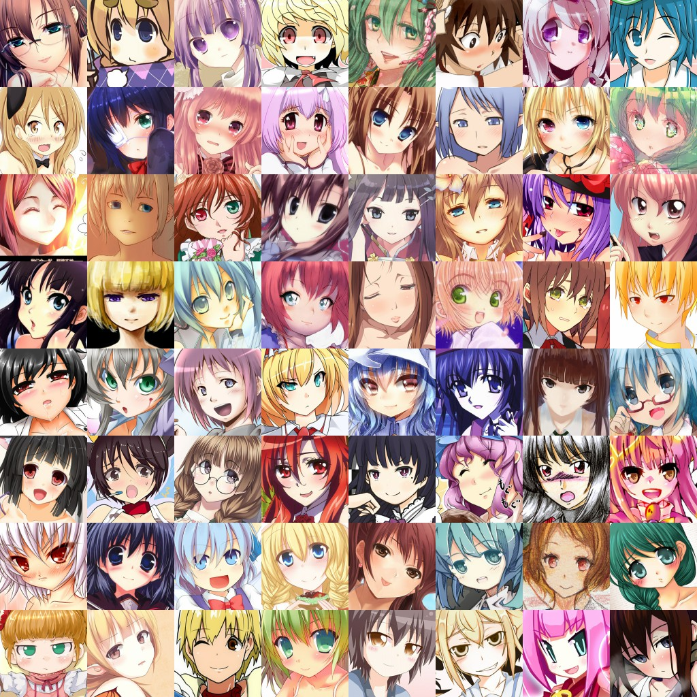
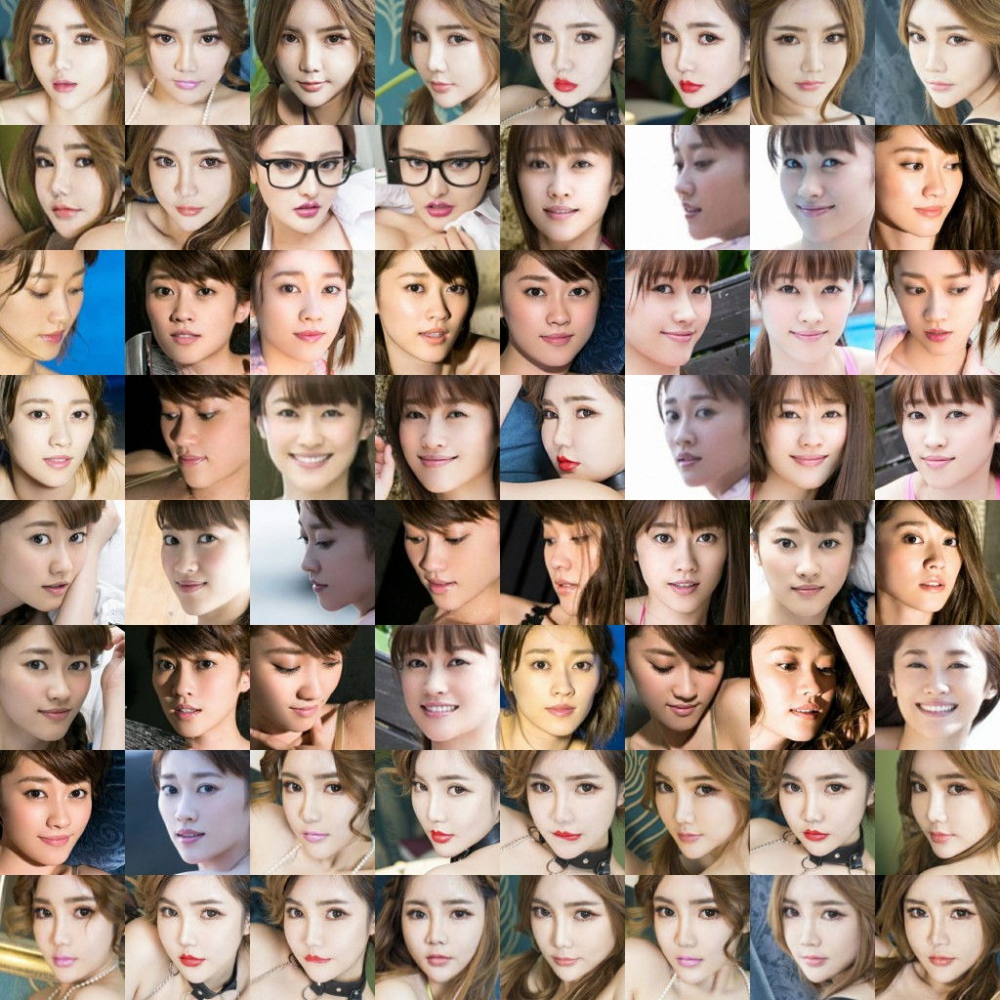

# human2anime

作者：穆朋朋

使用Mindspore+CycleGAN完成人脸到漫画脸的转换

## 作业要求

使用MindSpore实现基于GAN网络模型的漫画脸，输入一张图片，输出一张漫画脸，可用作手机变装、二次元风格等应用场景。

开放性的集成应用功能：

1. 基于漫画脸功能，实现染发等功能；
2. 基于漫画脸功能，实现变老、变儿童等功能；
3. 基于漫画脸功能，实现二次元风格；

我只完成了基本的漫画脸功能，由于选用的漫画脸数据集是二次元风格的，所以也实现了开放性功能3

## 算法模型选择

使用[Mindspore ModelZoo](https://gitee.com/mindspore/models/tree/master)中的[CycleGAN](https://gitee.com/mindspore/models/tree/master/research/cv/CycleGAN)模型代码

人脸向漫画脸的转换是Domain Adaptation问题，或者说风格迁移问题。可以使用的[Pix2Pix](https://arxiv.org/abs/1611.07004)和[CycleGAN](https://arxiv.org/abs/1703.10593)等，但前者要求训练数据必须是成对的，而现实生活中，要找到两个域(画风)中成对出现的图片是相当困难的；后者的优势是只需要两种域的数据，而不需要他们有严格对应关系，但生成效果不是特别好。基于数据集的获取难度，我选择了CycleGAN来做此任务。

### CycleGAN简介

对于两个数据集A和B，分布为DA和DB，CycleGAN想要训练两个生成器和两个鉴别器。

1. G_A：用B的图片生成A的图片的生成器
2. G_B: 用A的图片生成B的图片的生成器
3. D_A：判断图片是否属于A的鉴别器
4. D_B: 判断图片是否属于B的鉴别器

训练过程使用GAN的对抗训练策略；由于图片是非成对的，所以生成图片的质量难以评价，原论文提出以下两种loss用于训练：

1. GAN loss: 生成图片的质量应尽量骗过鉴别器
2. Cycle Consistency Loss: 对于A中的图片a，G_A(G_B(a))应尽可能接近a，此loss是为了生成图片与原图仅风格不同而内容相同；对于B中图片同样有类似loss.

论文中还有更多细节，我这里只是简单介绍，感兴趣可以查看原论文：[CycleGAN](https://arxiv.org/abs/1703.10593).

## 数据集选择

对于漫画脸，我从网络中搜索到了[动漫人脸数据集](http://www.seeprettyface.com/mydataset_page3.html#anime),

观察发现，动漫人脸数据集中的多为女的，男的不足1成，所以对于人脸数据集，我选择了[网红人脸数据集](http://www.seeprettyface.com/mydataset_page3.html#wanghong)

### 数据集简单预处理

由于选择的数据集已经是人脸部分，所以我只做了以下预处理工作：

1. 对每个数据集，等间隔采样得到10000张图片作为训练集，1000张图片作为测试集
2. 对每张图片，resize到256*256大小

后来在华为ModelArts平台训练时发现完成一次完整训练需要约70小时，而每小时需要约20元，由于只有500元代金券，所以无奈只能再次采样，**每个数据集的训练集只有1000张图片，测试集有100张图片**

## 实验部分

Mindspore框架可以在linux+GPU平台安装使用，我参考[MindSpore安装指南](https://www.mindspore.cn/install#%E5%AE%89%E8%A3%85cuda)尝试在实验室的服务器上安装该框架，但由于gcc和gmp的安装需要root权限，并未成功；最终只能在华为的ModelArts网上平台跑代码实验。

### 华为ModelArts平台使用

摸索发现，在ModelArts平台完成自定义数据集和自定义python代码的训练主要有以下步骤：

1. 登录OBS对象存储服务，创建OBS桶和文件夹；
2. 上传数据集和上传代码: 由于网页端上传只支持单一文件，在线解压非常复杂，而且还是测试版本，无法上传下载文件夹。无奈我使用了华为提供的工具：[obsutil](https://support.huaweicloud.com/utiltg-obs/obs_11_0001.html)；根据[教程](https://support.huaweicloud.com/utiltg-obs/obs_11_0003.html)下载安装该工具并[正确设置](https://support.huaweicloud.com/utiltg-obs/obs_11_0005.html)后可以传文件夹。
3. 在ModelArts管理控制台的训练管理-训练作业New页面，创建新的训练作业启动训练，作业的关键配置如下图所示,注意超参数设置我全部通过更改代码中的默认参数实现。

训练使用一张Ascend 910(32GB)，batch_size=1, total epoch = 200，learning_rate = 0.0002，几乎所有参数都和论文中使用的一致，训练时长为7小时。

加上之前试错使用的时长，总耗费代金券230元左右，没有再进行更进一步的其他实验。

## 实验结果展示

### 成功案例

生成效果整体看上去还算不错，细节部分有待提高，对于正脸的成功案例较多。

### 失败案例

失败案例主要有以下几种：

1. 五官生成效果差
2. 人脸上有头发等其他纹理特征
3. 人脸轮廓不鲜明

## 总结

我只完成了基本的漫画脸功能，由于选用的漫画脸数据集是二次元风格的，所以也实现了开放性功能3

总体来说，漫画脸生成效果不错，但细节部分的杂乱条纹过多，对于多变的人脸五官位置生成效果并不如意，正脸生成效果比侧脸更好一些，可能使用一些人脸相关的loss再加上人脸对齐预处理可使生成有所提高。
